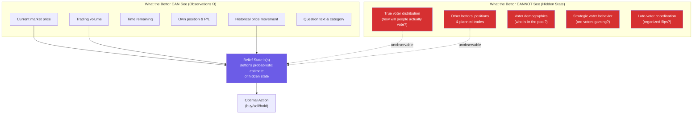
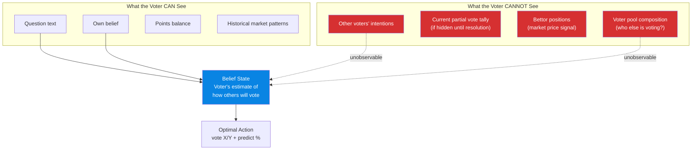
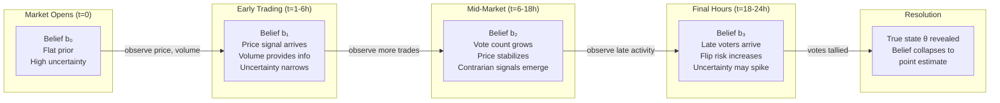
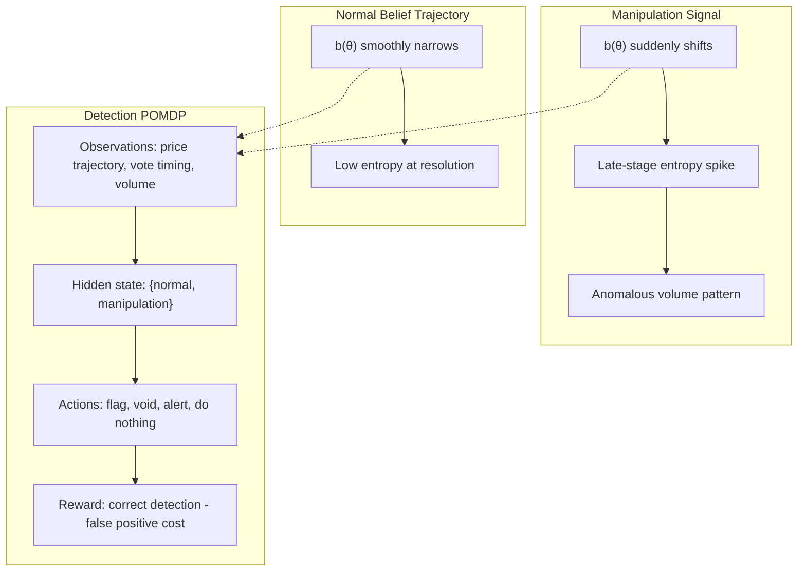
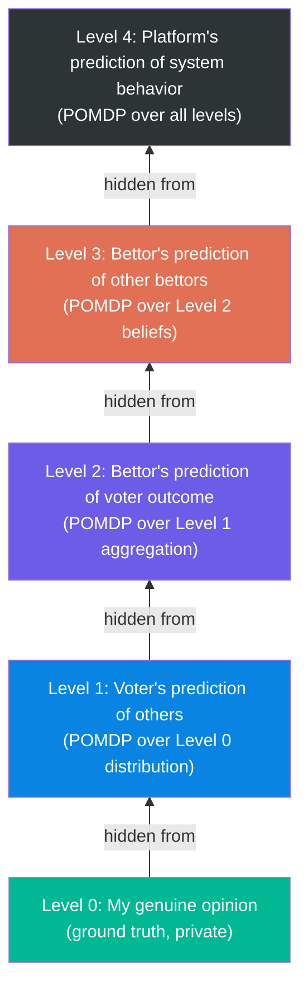

# MDP & POMDP Applied to FactMachine

## Why This Framework Matters

FactMachine's two-role architecture (bettors + voters) creates a system where **no single participant has full visibility** into the state of the world. Bettors can't see voter intent. Voters can't see bettor positions in real-time. The platform operator can't directly observe "true" opinion. This is textbook partial observability — and it's exactly what POMDPs were built to model.

> [!IMPORTANT]
> The key insight: an MDP assumes every agent can see the full state. FactMachine **violates this** for every participant. That's why the jump from MDP → POMDP isn't academic — it's the difference between a model that works and one that doesn't.

---

## Part 1: MDP Formulation (The Simplified View)

A Markov Decision Process is defined by the tuple **(S, A, T, R, γ)**:

| Component | Symbol | Meaning |
|-----------|--------|---------|
| **States** | S | All possible configurations of the market |
| **Actions** | A | Decisions available to the agent |
| **Transitions** | T(s'∣s,a) | Probability of moving to state s' given state s and action a |
| **Rewards** | R(s,a) | Immediate payoff for taking action a in state s |
| **Discount** | γ | How much future rewards are valued vs. immediate ones |

### MDP from the Bettor's Perspective

```
States S = {
  market_phase:     [pre_open, active, closing, resolved],
  current_price:    [0.01 ... 0.99],       // price of YES shares
  time_remaining:   [0 ... 24h],
  volume:           continuous,
  vote_count:       integer (if visible),
  own_position:     {long_X, long_Y, none}
}

Actions A = {
  buy_X(amount),
  buy_Y(amount),
  sell_X(amount),
  sell_Y(amount),
  hold
}

Transition T(s' | s, a):
  - Price moves based on order book impact of action a
  - Time decrements deterministically
  - Other agents' actions shift price stochastically
  - At resolution: state jumps to terminal based on vote outcome

Reward R(s, a):
  - At resolution: +payout if correct side, -stake if wrong
  - During market: unrealized P&L from price movement
  - Transaction costs (fees)
```

### MDP from the Voter's Perspective

```
States S = {
  question_text:        string,
  own_belief:           {X, Y},
  perceived_consensus:  [0.0 ... 1.0],   // % you think agree with you
  time_remaining:       [0 ... 24h],
  points_balance:       integer
}

Actions A = {
  vote_X(predicted_pct),
  vote_Y(predicted_pct),
  abstain
}

Transition T(s' | s, a):
  - Deterministic: your vote is cast
  - Stochastic: final vote tally depends on all other voters
  - Points awarded based on |predicted_pct - actual_pct|

Reward R(s, a):
  - Points proportional to prediction accuracy
  - Future value: points → cash or rolled into bets
```

### MDP from the Platform Operator's Perspective

```
States S = {
  active_markets:       integer,
  voter_pool_size:      integer,
  voter_demographics:   distribution,
  bettor_activity:      volume metrics,
  revenue:              fee income,
  manipulation_signals: anomaly scores,
  reputation_score:     public trust metric
}

Actions A = {
  create_market(question, duration, category),
  adjust_fees(rate),
  modify_voter_verification(strictness),
  flag_suspicious_activity(market_id),
  void_market(market_id),
  adjust_point_redemption_rate(rate)
}

Reward R(s, a):
  - Revenue (fees from trading volume)
  - User growth / retention
  - Market integrity score (inversely proportional to manipulation)
  - Negative reward for voided markets or public scandals
```

> [!NOTE]
> The MDP formulation is useful for **building intuition** but fundamentally flawed for FactMachine because it assumes the agent can observe the full state. No participant can. This is where POMDPs become essential.

---

## Part 2: POMDP Formulation (The Real Model)

A POMDP extends the MDP with **(S, A, T, R, γ, Ω, O)** where:

| Additional Component | Symbol | Meaning |
|---------------------|--------|---------|
| **Observations** | Ω | What the agent can actually see (partial state) |
| **Observation Function** | O(o∣s',a) | Probability of seeing observation o given true state s' after action a |

The agent maintains a **belief state** b(s) — a probability distribution over all possible true states — and updates it using Bayes' rule after each observation.

### POMDP: Bettor's Hidden Information



**The bettor's POMDP formally:**

```
Hidden State (what they can't see):
  θ = true voter split (e.g., 62% will vote X, 38% will vote Y)

Observations:
  o = {price, volume, time, price_history}

Belief Update (Bayesian):
  b'(θ) ∝ O(o | θ, a) · Σ T(θ | θ_prev, a) · b(θ_prev)

  Translation: After seeing the current price and volume,
  update your belief about how voters will actually vote.

Optimal Policy π*(b):
  The bettor's optimal strategy is a mapping from
  belief states to actions, NOT from observations to actions.

  This is critical: two bettors seeing the same price
  should act differently if they have different priors
  (e.g., one has domain expertise on the question).
```

### POMDP: Voter's Hidden Information



**The voter's strategic dilemma, formally:**

```
The voter faces a dual objective:

  1. Vote their genuine opinion (determines outcome)
  2. Predict the % who agree (determines points)

These objectives CONFLICT:

  If you believe 30% will agree with you (minority position):
    - Voting honestly → you lose the market but could earn
      points if your 30% prediction is accurate
    - Voting with majority → you help the "wrong" side win
      but your % prediction becomes easier (predict ~70%)

  POMDP captures this tension because the voter must estimate
  the hidden distribution of other voters' beliefs to make
  BOTH decisions optimally.
```

### POMDP: Platform Operator's Hidden Information

The platform operator has the most information but still faces critical unknowns:

```
Hidden States for the Operator:
  - True distribution of genuine opinions (vs. strategic votes)
  - Coordinated manipulation attempts in progress
  - Which voters are Sybil accounts that passed verification
  - Future regulatory actions
  - Long-term user trust trajectory

Observations:
  - Voting patterns and timing
  - Trading volume and price movements
  - User registration and verification metrics
  - Reports and complaints
  - External social media sentiment

Control Actions:
  - Market creation / curation
  - Verification strictness tuning
  - Fee adjustment
  - Anomaly detection thresholds
  - Market voiding decisions
```

---

## Part 3: Prediction — What Can Be Forecasted?

### Using the Belief State for Prediction

The POMDP framework gives us a principled way to make predictions at each layer:

| What to Predict | Who Predicts It | Key Hidden Variable | Method |
|----------------|----------------|---------------------|--------|
| Market outcome (which side wins) | Bettors | True voter distribution θ | Bayesian belief tracking over θ using price signals |
| Final vote percentage | Voters | Other voters' intentions | Estimate from question type, historical category data |
| Market manipulation | Platform | Coordinated actor strategies | Anomaly detection on belief-state trajectories |
| User churn | Platform | Individual user satisfaction (latent) | Hidden Markov Model on engagement sequences |
| Revenue trajectory | Platform | Market attractiveness (latent) | POMDP with market volume as partial observation |

### Belief State Dynamics Over a Market's Lifecycle



> [!TIP]
> **The non-obvious insight**: uncertainty doesn't always decrease monotonically. In the final hours, a surge of late voters can **increase** belief entropy if they deviate from early patterns. A sophisticated POMDP agent would widen its confidence interval in the last hour, not narrow it — and adjust position sizing accordingly.

---

## Part 4: Control — How the Platform Can Use This

### Control Problem 1: Incentive Design (Mechanism Design as POMDP)

The platform operator's POMDP can be framed as a **mechanism design** problem:

```
Goal: Design reward functions R_voter and R_bettor such that:

  1. Voters are incentivized to vote honestly (incentive compatibility)
  2. Bettors are incentivized to reveal true beliefs through prices
  3. The voter pool remains representative (participation constraint)
  4. The system is robust to coalitional deviations (group strategy-proofness)

POMDP Control Variables:
  - Point redemption rate (how valuable are voter points?)
  - Fee structure (flat vs. proportional)
  - Market duration (24h vs. shorter/longer)
  - Information disclosure (show partial results or not?)
  - Verification strictness (tradeoff: security vs. participation)
```

**Key Tradeoff (Formally):**

```
More info shown to voters during market (partial tallies)
  → Voters can update beliefs → more accurate % predictions → happier voters
  → BUT: enables strategic voting (bandwagon effect)
  → AND: enables temporal manipulation (late coordination)

Less info shown
  → Voters must vote on genuine priors → more honest signal
  → BUT: worse % prediction accuracy → lower voter satisfaction
  → AND: bettors lose a signal channel → less efficient prices

This is a CLASSIC POMDP design problem: how much observability
to grant agents, knowing that observations change behavior.
```

### Control Problem 2: Manipulation Detection



The platform can run a **meta-POMDP** where:
- The hidden state is whether manipulation is occurring
- Observations are the statistical signatures of trading and voting patterns
- Actions are interventions (flag, void, increase monitoring)
- Rewards balance false positives (voiding legitimate markets) against false negatives (letting manipulation pass)

### Control Problem 3: Market Curation & Sequencing

```
Which markets to create, and when, is itself a sequential decision problem:

State:
  - Current active markets by category
  - User engagement levels by category
  - Time of day / day of week
  - Recent market outcomes (winning streaks affect participation)

Actions:
  - Launch market in category C with question Q
  - Adjust market duration
  - Feature/promote specific market

Hidden State:
  - User fatigue (latent)
  - Trending topics not yet captured
  - Competitor activity

Reward:
  - Trading volume generated
  - New user acquisition
  - Voter participation rate
  - Revenue from fees
```

---

## Part 5: The Recursive Meta-Game (Keynesian Beauty Contest as POMDP)

FactMachine creates a **nested POMDP** structure that mirrors Keynes's famous beauty contest:

```
Level 0: What do I believe?                    (voter's own opinion)
Level 1: What do I think others believe?       (voter's prediction task)
Level 2: What do bettors think voters believe?  (bettor's prediction task)
Level 3: What do other bettors think bettors
         think voters believe?                  (meta-bettor strategy)
Level 4: What does the platform think all of
         the above will converge to?            (platform control)
```

Each level is a POMDP where the hidden state is the level below:



> [!WARNING]
> **Convergence is not guaranteed.** In standard prediction markets, the "no-trade theorem" and efficient market hypothesis suggest prices converge to truth. In FactMachine, prices converge to **predicted voter behavior**, which may diverge from truth. The POMDP at Level 2 may have multiple equilibria, and the system can settle into a stable-but-wrong state (Scenario 2/7 from the outcome matrix: Consensus Delusion).

---

## Part 6: Practical Applications for the Platform

### What the Operator Should Build

| System | POMDP Component | Implementation |
|--------|----------------|----------------|
| **Anomaly Detector** | Meta-POMDP over {normal, manipulated} | Monitor belief-trajectory entropy; flag markets where b(θ) shifts abruptly in the last 2 hours |
| **Dynamic Market Tuner** | Control POMDP over market parameters | Adjust duration, fees, and question framing based on observed category engagement |
| **Voter Pool Health Monitor** | POMDP over voter demographics | Track distributional shift in voter pool vs. general population proxies |
| **Strategic Voting Detector** | POMDP over {honest, strategic} per voter | Flag voters whose % predictions are systematically too accurate (signals bandwagon voting) |
| **Revenue Optimizer** | MDP over fee/volume tradeoff | Classic operations research — can be simplified to MDP since volume data is fully observable |
| **Question Recommender** | POMDP over user engagement (latent) | Content recommendation as a POMDP where user fatigue is hidden |

### The Operator's Policy Gradient

The platform's optimal policy π* can be approximated using:

```
For each market m:
  1. Observe: o_m = {volume, vote_count, price_trajectory, timing_patterns}
  2. Update belief: b_m(manipulation) using Bayesian filter
  3. If b_m(manipulation) > threshold_α:
       → Action: increase monitoring, consider voiding
  4. If b_m(low_engagement) > threshold_β:
       → Action: promote market, adjust featured placement
  5. After resolution:
       → Update model parameters using outcome as ground truth
       → Retrain voter pool health estimator
```

---

## Part 7: Why POMDP > MDP for FactMachine (Summary)

| Dimension | MDP Assumes | POMDP Captures | FactMachine Reality |
|-----------|-------------|----------------|---------------------|
| **Voter intent** | Fully observable | Hidden, estimated via signals | Voters' true opinions are private |
| **Other bettors** | Positions visible | Only aggregate price visible | Individual positions are hidden |
| **Manipulation** | Either happening or not (known) | Latent variable with probabilistic detection | Manipulation is ambiguous and gradual |
| **Strategic behavior** | Agents play known strategies | Strategies are hidden, inferred from actions | Both voters and bettors may game the system |
| **Voter pool composition** | Known demographics | Estimated from voting patterns | Self-selected, skew unknown |
| **Future participation** | Deterministic | Stochastic, depends on latent engagement | Users churn unpredictably |

> [!IMPORTANT]
> **The bottom line**: An MDP model of FactMachine would be equivalent to assuming every participant plays a transparent, non-strategic game. A POMDP model captures the *actual* information asymmetries that make opinion markets interesting — and dangerous. Any serious attempt to control, predict, or optimize the platform **must** operate at the POMDP level.

---

## Appendix: Connection to the 8-Scenario Outcome Matrix

Each of the 8 scenarios from the previous analysis maps to a specific POMDP belief-state failure:

| Scenario | POMDP Interpretation |
|----------|---------------------|
| **#1 Perfect Alignment** | All agents' beliefs converged to truth; belief states were well-calibrated |
| **#2 Consensus Delusion** | Bettors and voters had well-calibrated beliefs about *each other*, but all beliefs were anchored to a false prior about reality |
| **#3 Voter Surprise** | Bettors' belief state b(θ_voter) was **miscalibrated** — their model of voter behavior was wrong |
| **#4 Contrarian Victory** | Minority bettors had a **superior observation model** O(o\|s) that let them detect the true voter lean despite misleading price signals |
| **#5 Bettor Surprise** | The aggregate bettor belief b(θ) suffered from **herding** — correlated errors in belief formation |
| **#6 Manufactured Consensus** | The **observation function O itself was biased** — voter pool non-representativeness meant observations were systematically misleading |
| **#7 Consensus Delusion** | Same as #2: a stable but false equilibrium in the belief dynamics |
| **#8 Perfect Alignment** | Same as #1: well-calibrated beliefs all around |

The POMDP framework tells you exactly **where** each failure occurs in the information-processing pipeline, which means you can design targeted interventions for each failure mode.
